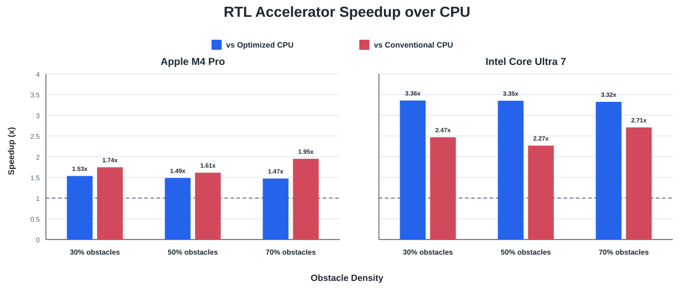
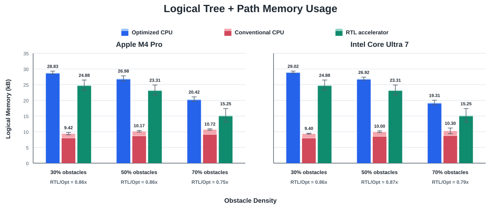

# A 4-PE Grid-Indexed Dual-Tree RRT Accelerator for 3-D Path Planning

This repository is the final research artifact of an undergraduate project on
hardware acceleration for three-dimensional rapidly-exploring random tree
(RRT) path planning. It contains the optimized software model, deterministic
benchmark infrastructure, synthesizable SystemVerilog, synthesis and gate-level
artifacts, and the constraints used for physical implementation.

> Project status: completed research prototype (2026). The current hardware
> design is `RTL_Project/01_RTL`; the other RTL variants are retained as design
> history.

## Project Summary

The accelerator grows start and goal trees concurrently with four processing
elements (PEs). Each PE follows the same planning pipeline:

1. Accept a 24-bit random sample.
2. Find a nearest node using a 16 x 16 x 16 grid index.
3. Quantize the direction vector without division or square root.
4. Extend a branch by up to eight voxels while checking the obstacle map.
5. Check the opposite tree, insert a valid node, and reconstruct a path when
   the two trees meet.

The design uses shared tree and map ports with round-robin arbitration. Tree
cells store bounded node lists, which changes nearest-neighbor work from a full
tree scan into a local indexed search suitable for hardware.

## Main Contributions

- Four-PE dual-tree search with balanced no-map tree growth.
- Grid-indexed bounded nearest-neighbor search with root-directed fallback.
- Shift-and-compare vector quantization and multi-voxel branch extension.
- Shared-memory arbitration, duplicate filtering, connection checking, and
  hardware path reconstruction.
- Deterministic 3-D map generation with density balancing and a guaranteed path
  certificate.
- Paired software/RTL benchmarks over 10 maps and 50 random seeds per obstacle
  density.

## Key Results

The RTL benchmark used a 3.3 ns clock period. One task is one complete planning
request from `(0, 0, 0)` to `(255, 255, 255)` for one map and random seed.

| Obstacle density | Successful tasks | Mean cycles/task | Mean latency (ms/task) |
| ---: | ---: | ---: | ---: |
| 30% | 500 / 500 | 227,348.810 | 0.7503 |
| 50% | 500 / 500 | 358,212.636 | 1.1821 |
| 70% | 500 / 500 | 555,433.548 | 1.8329 |
| Equal-weight mean | 1,500 / 1,500 | 380,331.665 | 1.2551 |

Final post-route implementation summary:

| Item | Result |
| --- | ---: |
| Process | TSMC 130 nm, 8 metal layers |
| Clock | 303.03 MHz (3.3 ns) |
| Block area | 0.2756 mm^2 |
| Core area | 0.2502 mm^2 |
| Standard-cell area | 0.1464 mm^2 |
| Core utilization | 58.50% |
| Functional instances | 13,786 |
| Post-route setup WNS / TNS | +0.008 ns / 0 ns |
| Post-route hold WNS / TNS | +0.001 ns / 0 ns |

The physical figures describe the synthesized logic core and exclude external
map, tree, and path memories. Power and energy per task are not reported because
no validated activity-based post-route power analysis is available.





See [Results and Methodology](docs/RESULTS.md) for the full interpretation and
limitations of these measurements.

## Repository Layout

```text
.
|-- 2D/                         Preliminary static 2-D prototype
|-- 2D_Dynamic/                 Preliminary dynamic-map 2-D prototype
|-- 3D/                         Optimized and conventional C++ models
|-- RTL_Project/
|   |-- 01_RTL/                 Current synthesizable RTL and testbench
|   |-- 02_SYN/                 Synthesis scripts, reports, and netlist
|   |-- 03_GATE/                Gate-level simulation script
|   |-- 04_APR/                 MMMC view and final timing constraints
|   |-- 4_core_v1/              Historical four-PE design snapshot
|   |-- 4_core_v2/              Pre-optimization four-PE snapshot
|   |-- 8_core/                 Historical eight-PE experiment
|   |-- Single Tree/            Historical single-tree experiment
|   `-- outputs/                Figure source and generated SVG charts
|-- docs/                       Architecture, results, and reproduction notes
`-- .github/workflows/          Source-build checks
```

Generated occupancy maps, executables, waveforms, simulator work directories,
the contest PDK, and copyrighted reference PDFs are intentionally excluded.

## Project Evolution

`2D/` and `2D_Dynamic/` preserve the exploratory software prototypes that
preceded the final study. They are included for traceability, but their results
are not used in the reported 3-D accelerator comparison. `3D/` is the software
benchmark for the final algorithm, and `RTL_Project/01_RTL/` is the current
hardware implementation.

## Quick Start

### Software benchmark

```bash
cd 3D
python3 map_generator.py --density 30 --seed 1000 --count 10 --output-dir map
g++ -O3 -DNDEBUG -std=c++17 rrt.cpp -o rrt
g++ -O3 -DNDEBUG -std=c++17 rrt_con.cpp -o rrt_con
CPU_CORE=2 MAPDIR=map ./run_10maps.sh 42 5 50 1
```

### RTL source check

```bash
cd RTL_Project/01_RTL
iverilog -g2012 -DRTL_TOP -s TESTBED -o /tmp/rrt_rtl.vvp TESTBED.sv
vvp /tmp/rrt_rtl.vvp +NOMAP +SEED=42
```

The Cadence testbench flow is documented in
[RTL_Project/README.md](RTL_Project/README.md). Complete benchmark and ASIC flow
instructions are in [Reproducibility](docs/REPRODUCIBILITY.md).

## Documentation

- [Hardware Architecture](docs/ARCHITECTURE.md)
- [Results and Methodology](docs/RESULTS.md)
- [Reproducibility](docs/REPRODUCIBILITY.md)
- [Static 2-D Prototype](2D/README.md)
- [Dynamic 2-D Prototype](2D_Dynamic/README.md)
- [Software Model](3D/README.md)
- [RTL and ASIC Flow](RTL_Project/README.md)

## Research Reference

This project was inspired by C.-M. Chung and C.-C. Yang, "A 1.5-uJ/Task
Path-Planning Processor for 2-D/3-D Autonomous Navigation of Microrobots,"
*IEEE Journal of Solid-State Circuits*, 2021,
[doi:10.1109/JSSC.2020.3037138](https://doi.org/10.1109/JSSC.2020.3037138).

## Use and Licensing

No open-source license has been granted for this repository. The material is
published for academic inspection and reproducibility; all rights remain with
the project author unless a license is added later. Commercial EDA tools and
the TSMC/CBDK technology files are governed by their respective licenses and
are not redistributed here.
