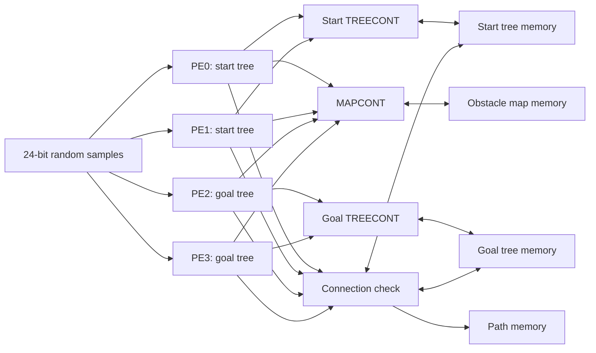

# Hardware Architecture

## System Overview

The accelerator implements a dual-tree RRT over a 256 x 256 x 256 voxel map.
PE0 and PE1 grow the start tree; PE2 and PE3 grow the goal tree. Shared arbiters
serialize accesses to external tree and obstacle memories while allowing PE
control pipelines to proceed independently.



## PE Dataflow

Each PE enforces the sequence required by the planner:

```text
random sample
    -> registered input
    -> grid-address selection
    -> registered tree-memory response
    -> bounded nearest-neighbor comparison
    -> direction quantization
    -> branch extension
    -> registered map-memory response
    -> candidate node and parent output
```

Memory responses and testbench inputs are registered before they are consumed.
State storage is implemented in sequential blocks, while next-state and
datapath selection are kept in combinational blocks. This coding discipline
limits accidental combinational feedback and makes timing boundaries explicit.

### Grid-indexed nearest-neighbor search

The upper four bits of each coordinate select one of 16 x 16 x 16 grid cells.
Each RTL cell stores at most 15 node records. A record contains a 24-bit
coordinate and a 16-bit parent pointer encoded as grid coordinates plus slot.
Slot `0xF` remains reserved so `0xFFFF` can identify a root parent.

The PE first probes the sample's grid cell. If it is empty, the PE examines a
root-side half-neighborhood rather than all 26 surrounding cells. Wider PE
search modes add three lateral probes after a collision. If local probes remain
empty, the address marches toward the active tree's root until a non-empty cell
is found.

Within the selected cell, the PE compares a bounded set of candidates using an
L1-equivalent local score. The search stops after the first suitable non-empty
cell, trading exact global nearest-neighbor quality for deterministic memory
work and lower latency.

### Direction quantization and extension

The direction from the selected node to the random sample is quantized into
signed axis steps using comparisons and shifts. No divider, square-root unit,
or general multiplier is required. The branch extender advances by up to eight
voxels and requests an obstacle-map read for each candidate step. If the first
diagonal step is blocked, the active axes are retried in X/Y/Z order.

## Shared Memory Access

Two `TREECONT` instances arbitrate nearest-neighbor reads: one serves the two
start-tree PEs and one serves the two goal-tree PEs. `MAPCONT` serves all four
PEs through one map read port. Its rotating selection state changes priority so
the same requester does not permanently dominate the port.

The arbiters separate request selection from registered ownership. The
registered owner identifies which PE receives the following synchronous memory
response. This one-cycle request/response contract is also used by the
connection-check path.

## Connection and Path Reconstruction

The connection-check block receives an extended node and its parent. It first
rejects an exact duplicate in the active tree. A localized cell search then
checks the opposite tree for a node within the accepted voxel neighborhood.
When no connection exists, the valid node is written into the active tree. When
the trees meet, parent pointers are followed from both meeting nodes and the two
halves are written into path memory in start-to-goal order.

This block centralizes writes and reconstruction, avoiding duplicated control
logic in all four PEs. The trade-off is serialized completion traffic when
several PEs finish extensions close together.

## Design Trade-offs

| Decision | Benefit | Cost |
| --- | --- | --- |
| Bounded grid cells | Fixed-width address and bounded NN work | A full cell rejects additional nodes |
| Root-side local probes | Lower expected NN latency | Approximate rather than global nearest node |
| Shared map port | Smaller memory interface and arbiter area | Contention among four PEs |
| Eight-voxel extension | Fewer planning iterations | More collision reads per accepted branch |
| Central connection check | Shared duplicate and path logic | Serialized insertion/reconstruction |
| Registered memory inputs | Clear timing boundaries at 3.3 ns | One-cycle response latency |

## Implementation Boundary

`RRT_TOP` contains the synthesizable control and datapath logic. The supplied
`TREEMEM`, `MAPMEM`, and `PATHMEM` are behavioral integration models. Final APR
area therefore represents the logic core only and must not be interpreted as a
complete memory-inclusive chip area.
